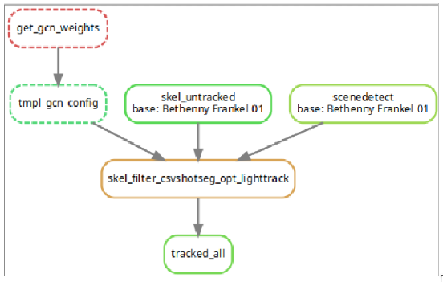

# Snakemake 

## What & Why

*tbd*

## How to run

* Depending on your installation, you may need to run `poetry run snakemake cmd` instead of `snakemake cmd`. On the [HPC](setup_hpc.md), you need to run snakemake-commands as `./run_coord.sh snakemake cmd` or even `./run_coord.sh poetry run snakemake cmd`
* Very important modifiers are `-p`, which prints all commands the snakemake-workflow is executing, and `-n`, which lets snakemake go for a dry-run. With these arguments combined, you can test what snakemake *would* execute, to better understand what's going to be run in the following.
* To see what commands you can run, go for
    ```
    snakemake --list
    ```
* To create a dependency-graph why snakemake runs what in what order, run 
  ```
  snakemake --dag --config \
      VIDEO_BASE=path/to/your/dataset \
      DUMP_BASE=path/to/your/dump \
   -np | dot -Tsvg > dag.svg       
  ```
  This will visualize the directed acyclic graph that snakemake creates, like so:
  . It is very useful if you want to know why certain commands are run (which you figured out using `-pn` for an informed dry-run)
* The entire pipeline is run with this command:
    ```
    snakemake tracked_all --cores 8 --config VIDEO_BASE=path/to/your/dataset DUMP_BASE=path/to/your/dump 
    ```
  * ...however, depending on your installation, you may need a few environment-variables as well, so for me it was rather:
      ```
      export SKELSHOP_DEPS=path/to/skelshop_deps 
      export SKELSHOP_PATH=path/to/skelshop
      ```
      and
      ```
      OPENPOSE=$SKELSHOP_DEPS/openpose_cpu/ \
      LD_LIBRARY_PATH=$SKELSHOP_DEPS/openpose_cpu/build/src/openpose/ \
      PYTHONPATH=$SKELSHOP_DEPS/openpose_cpu/build/python/:$SKELSHOP_PATH:$SKELSHOP_PATH/submodules/lighttrack/graph:$PYTHONPATH \
      MODEL_FOLDER=$SKELSHOP_DEPS/openpose_cpu/models \
      poetry run snakemake tracked_all \
          --cores 8 \
          --config \
          VIDEO_BASE=path/to/your/dataset \
          DUMP_BASE=path/to/your/dump \
          WORK=path/to/your/work \
          -p
      ```
      plus `-n` if you just want to see what this executes.
* To delete previous (partial) results, do
  ```
    snakemake tracked_all --cores 8 --config VIDEO_BASE=path/to/your/dataset DUMP_BASE=path/to/your/dump --delete-all-output   
  ```  
  * Also, you may want to `rm *.out && rm -r path/to/your/work && rm -r path/to/your/dump`

## What it runs

The command `tracked_all` from our previous image runs the following: 
* skel_untracked: `python -m skelshop dump --mode BODY_25_ALL /path/to/Bethenny Frankel 01.mp4 path/to/Bethenny Frankel 01.untracked.h5`
* scenedetect
* get_gcn_weights: `mkdir -p work/gcn_weights && cd work/gcn_weights && wget http://guanghan.info/download/Data/LightTrack/weights/GCN.zip && unzip GCN.zip`
* tmpl_gcn_config:
* skel_filter_csvshotseg_opt_lighttrack: `python -m skelshop filter --track --track-conf opt_lighttrack --pose-matcher-config work/gcn_config.yaml --shot-seg=psd --segs-file path/to/Bethenny Frankel 01-Scenes.csv path/to/Bethenny Frankel 01.untracked.h5 path/to/Bethenny Frankel 01.opt_lighttrack.h5`