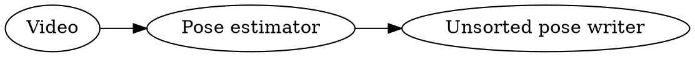

## Skeleton pipeline 

The overall skeleton pipeline goes like so

But note these steps can be left out so we can dump first and do tracking later
if we like e.g. first run

And then later run 

Pipelines starting with the pose estimator are run using the `dump` command,
while pipelines starting from existing pose dumps using the `filter` command.
Which method is used for different . See next [CLI examples](cli.md)
and [CLI reference](cli.md).

## Face pipeline

The face pipeline can run in two modes. In the first mode, which is not
recommended for most usages, dlib's face detection and face keypoint detection
pipeline is used. There is some information about [the dlib keypoint detection
in this blog
post](https://www.pyimagesearch.com/2017/04/03/facial-landmarks-dlib-opencv-python/).
In the second mode, an existing pose dump including these 68-keypoints as
estimated by OpenPose is used. The second is preferred in most situations.

Dlib only pipeline:

```graphviz dot dlibpipe.png
    digraph G {
        rankdir=LR
        video [label="Video"]
        dlibfacedetector [label="Dlib CNN face detector"]
        dlibfaceposeestimator [label="Dlib 68-point face keypoint detector (CPU only)"]
        chipcropper [label="Dlib chip cropper"]
        writer [label="Embedding writer"]
        video -> dlibfacedetector -> dlibfaceposeestimator -> chipcropper -> writer;
    }
```

Skeleton-based pipeline:

